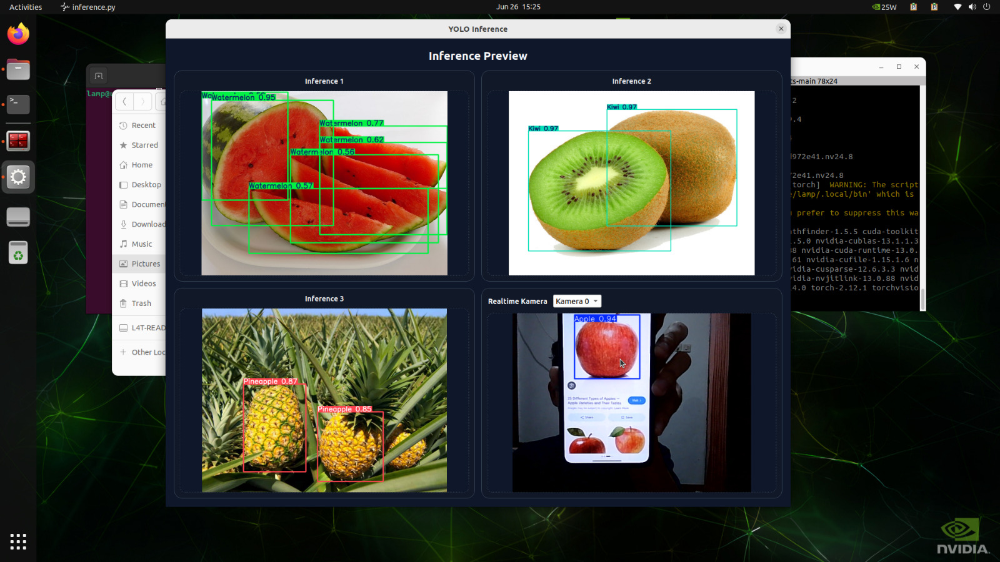

# AI Training



## Ringkasan Proyek

Folder ini berisi pipeline AI untuk **deteksi buah** menggunakan model YOLO (Ultralytics), mulai dari training, hingga inference (prediksi) pada gambar statis dan kamera real-time.

Dataset training mengacu pada project Fruits by YOLO:

- 9 kelas: Apple, Banana, Grapes, Kiwi, Mango, Orange, Pineapple, Sugerapple, Watermelon

## Purpose / Tujuan

Tujuan utama proyek ini adalah:

- Melatih model object detection untuk mengenali berbagai jenis buah.
- Menyediakan antarmuka inference yang siap pakai untuk validasi hasil model.
- Menjadi fondasi untuk integrasi ke modul lain (misalnya IoT/camera stream).

## Struktur File Penting

- `train.ipynb`:
  Notebook utama untuk proses training model YOLO.
- `inference.py`:
  Script inference dengan UI desktop (Qt) untuk prediksi gambar dan kamera.
- `data.yaml`:
  Konfigurasi dataset (path train/val/test, jumlah kelas, nama kelas).
- `model.pt`:
   **Model hasil training terbaik** yang dipakai sebagai default model pada inference.
   Secara eksplisit: model.pt adalah model hasil train terbaik.

## Kode untuk Training

Training dilakukan pada notebook `train.ipynb`.

Alur inti training di notebook:

1. Import library Ultralytics.
2. Inisialisasi model dasar (`yolo26n.pt`).
3. Menjalankan training dengan konfigurasi dataset `data.yaml`.

Contoh inti kode training (sesuai notebook):

```python
from ultralytics import YOLO

model = YOLO("yolo26n.pt")
model.train(data="data.yaml", epochs=100, imgsz=640)
```

## Kode untuk Inference

Inference utama dijalankan dari `inference.py`.

Perintah menjalankan inference:

```bash
python inference.py
```

Script akan memuat model dari:

- `model.pt` (default)

## Fitur Inference

Fitur-fitur yang tersedia pada `inference.py`:

1. Multi-backend Qt otomatis
   - Mencoba `PyQt5` terlebih dulu, lalu fallback ke `PySide6` jika tidak tersedia.

2. Validasi awal file penting
   - Mengecek keberadaan `model.pt`.
   - Mengecek gambar referensi di folder `inferences/` (`random_1.jpg`, `random_2.jpg`, `random_3.jpg`).

3. Tampilan dashboard 2x2
   - Tile 1-3: hasil inference dari 3 gambar statis.
   - Tile 4: inference **real-time** dari kamera.

4. Prediksi object detection + visualisasi
   - Menjalankan `model.predict(...)` lalu menampilkan hasil anotasi bounding box dari `result.plot()`.

5. Pemilihan kamera dinamis
   - Scan index kamera yang tersedia.
   - Pilih kamera dari dropdown tanpa restart aplikasi.

6. Refresh real-time terjadwal
   - Frame kamera diproses periodik menggunakan `QTimer` (interval sekitar 120 ms).

7. Confidence threshold untuk stream kamera
   - Inference kamera menggunakan parameter `conf=0.6` agar prediksi lebih terfilter.

8. Preview adaptif
   - Gambar/hasil inferensi diskalakan proporsional saat ukuran jendela berubah.

## Dependensi

Dependensi Python utama untuk proyek ini:

- `ultralytics` (training + inference YOLO)
- `opencv-python` (akses kamera dan pemrosesan frame)
- `PySide6` (UI desktop inference, backend Qt)
- `jupyter` dan `ipykernel` (menjalankan notebook training)

Semua paket di atas sudah dirangkum pada file `requirements.txt`.

## Setup Environment

Langkah setup (Bash Linux):

```bash
cd 1_ai_training
python -m venv .venv
source .venv/bin/activate
python -m pip install --upgrade pip
pip install -r requirements.txt
```

Jika environment aktif, prompt terminal biasanya menampilkan prefix `(.venv)`.

### Menjalankan Inference

```bash
python inference.py
```

### Menjalankan Training

> Pastikan sudah melakukan setup dataset YOLO sesuai data.yaml

```bash
jupyter notebook train.ipynb
```

## Catatan

- Jika ingin retrain dari awal, jalankan kembali notebook `train.ipynb`.
- Jika ingin mengganti model inference, cukup ganti file `model.pt`.
